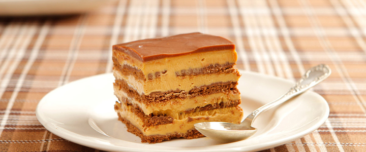
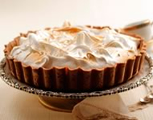
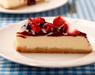
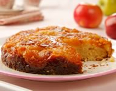

# Ejercicio

Para completar el ejercicio deben escribir el código HTML/CSS necesario para el
diseño de la receta que se adjunta.

*Nota:* las medidas que no se indiquen, las pueden definir a "ojímetro".

## Links de interés

- Referencia HTML: https://developer.mozilla.org/en-US/docs/Web/HTML/Element
- Referencia CSS: https://developer.mozilla.org/en-US/docs/Web/CSS/Reference

## Imágenes necesarias

```html




```
